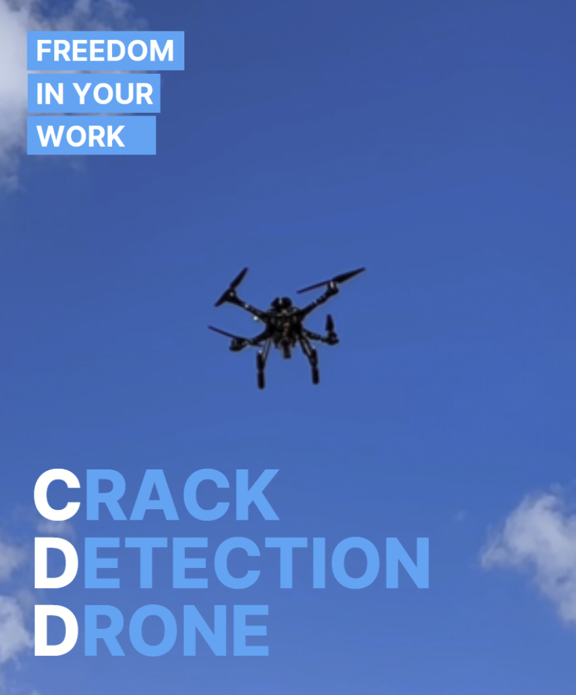

 

# 유승현

### 모으고 가공하고 만드는 개발자

 

*문제를 정의하고, 해결 방법을 찾고, 그 과정에서 AI와 협업합니다.*  
*결과물보다 과정이 저를 설명합니다.*

 
 

---

 

> *"AI는 나의 도구이자 동료입니다.*  
> *하지만 문제를 정의하고, 방향을 정하고,*  
> *책임지는 것은 언제나 '나'입니다."*

 
 

---

 

## CASE STUDIES

 

### 01. PROMTREE

**"흩어진 문서에서 지식을 모으다"**

`2025.10 - 11` · `6인 팀` · `삼성전자 생산기술연구소 연계`

 

 
 

**문제**  
삼성전자 생산기술연구소의 엔지니어들은 물성 예측 모델을 개발하기 위해 대용량의 데이터셋이 필요했습니다.  
하지만 원천 자료는 수천 개의 PDF 문서에 흩어져 있었고, 문서마다 형식이 달랐습니다.

 

**접근**  
기존 PDF 파싱 라이브러리들의 한계를 분석하고, PDF 표준(ISO 32000)을 연구했습니다.  
Claude와 함께 "정규표현식으로 테이블을 찾는 건 왜 실패하는가?"라는 질문에서 시작해,  
**좌표 기반 접근법**이라는 새로운 방향을 찾았습니다.

 

**해결**  
- **자체 PDF Parser:** 좌표 분석 + Document Layout Model로 테이블/텍스트 구조화  
- **Extract RAG:** 마크다운에서 필요한 물성 정보만 추출, 규격화  
- **검색 챗봇:** FastAPI + Qdrant 기반 자연어 검색  

 

**담당 역할** `AI` `Backend`  
- 자체 Parser 개발  
- PDF에서 물질 정보 추출 파이프라인 구축  
- FastAPI를 활용한 챗봇 백엔드 구축  
- Qdrant를 활용한 벡터 저장 및 검색 기능  

 

**성과**  
삼성전자 생산기술연구소 사내 알파 테스트에 활용

 

> 💡 **Learning**  
> *"완벽한 자동화보다, 신뢰할 수 있는 반자동화가 더 가치 있습니다.  
> 99%의 자동화와 1%의 인간 검증이 100%의 자동화보다 현실적이고,  
> 사용자가 신뢰할 수 있는 시스템이 결국 더 오래 쓰입니다."*

 

[🔗 GitHub](https://github.com/Yoo-SeungHyeon/PROMTREE)

 

---

 

### 02. DAILYPET

**"일상의 데이터에서 건강의 신호를 읽다"**

`2025.09` · `6인 팀` · `SSAFY 특화 프로젝트 우수상 (2등)`

 

 
 

**문제**  
반려동물은 말을 하지 못합니다. 아파도 숨기는 경향이 있고,  
보호자가 이상을 느꼈을 때는 이미 상태가 악화된 경우가 많습니다.  
매일 기록하는 산책 시간, 식사량, 수면 패턴... 이 **일상 데이터**에서 건강 이상의 조기 신호를 찾을 수 있지 않을까?

 

**접근**  
여러 이상치 탐지 모델을 비교 분석하면서, 각 모델의 특성과 데이터의 특성을 매칭했습니다.  
특히 **Cold Start 문제**(새 사용자는 데이터가 없는데 어떻게 "평소"를 정의할 것인가?)를 해결하기 위해  
**Isolation Forest + IQR 하이브리드** 방식을 채택했습니다.

 

**해결**  
- **일상 기록:** 모바일/웨어러블로 식사·산책 등 데이터 수집  
- **건강 모니터링:** 복합 지표 가중치 + 연속성 체크 + 심각도 등급화  
- **맞춤 추천:** 품종, 나이, 활동량, 건강 기록 기반 RAG 펫 금융상품 추천  

 

**담당 역할** `AI` `Infra` `PM`  
- 이상치 탐지 AI 모델 개발  
- RAG 기반 데이터 추출 기능 개발  
- 금융상품 추천 모델 개발  
- 인프라: 설계, 배포, CI/CD, IaC, 모니터링 구축  
- 관리자 페이지 개발  

 

**성과**  
🏆 SSAFY 특화 프로젝트 우수상 (2등)

 

> 💡 **Learning**  
> *"좋은 AI 모델보다 좋은 데이터 설계가 먼저입니다.  
> 어떤 데이터를 어떻게 수집할지, 수집 단계에서의 설계가  
> 전체 시스템의 성능 상한선을 결정합니다."*

 

[🔗 GitHub](https://github.com/Yoo-SeungHyeon/DAILYPET)

 

---

 

### 03. CDD

**"사람이 갈 수 없는 곳의 눈이 되다"**

`2025.07 - 08` · `6인 팀` · `SSAFY 공통 프로젝트 우수상 (3등)`

 

 
 

**문제**  
고층 건물, 교량 하부, 댐 벽면... 대형 구조물의 균열 점검은 위험하고 비용이 많이 듭니다.  
**드론과 AI**를 결합하면, 안전하고 빠르게 정밀 점검을 할 수 있지 않을까?

 

**접근**  
처음 계획은 단순했습니다. 드론이 촬영 → 서버로 전송 → AI 분석 → 결과 반환.  
하지만 실시간 점검이 필요한 현장에서 **네트워크 지연**은 치명적이었습니다.  
결국 **온디바이스 AI**로 방향을 틀었고, Jetson Orin Nano에서  
**GPU 기반 MJPEG 인코딩 + RTSP 전송**으로 50ms 지연, 최대 50fps를 달성했습니다.

 

**해결**  
- **실시간 탐지:** YOLO 기반 온디바이스 AI 균열 감지  
- **깊이 측정:** LiDAR + Segmentation 모델로 균열의 3D 정보 추출  
- **기록 및 공유:** 녹화 영상 3D 렌더링, 웹 공유  

 

**담당 역할** `AI` `Infra` `Embedded`  
- YOLO 모델을 활용한 실시간 균열 감지 모델 개발  
- LiDAR 기반 균열 깊이 측정 기능 개발  
- 실시간 영상 송출 기능 개발  
- AWS 인프라 설계 및 구축  

 

**성과**  
🏆 SSAFY 공통 프로젝트 우수상 (3등)

 

> 💡 **Learning**  
> *"엣지 디바이스에서의 AI는 클라우드와 완전히 다른 제약이 있습니다.  
> 제한된 자원 안에서 최선의 트레이드오프를 찾는 것,  
> 그것이 진짜 엔지니어링입니다."*

 

[🔗 GitHub](https://github.com/SSAFY-CDD)

 

---

 

## ABOUT

 

**Education**  
영남대학교 산업공학과 & 컴퓨터공학과 복수전공 · 2021 - 2025  
삼성 청년 SW 아카데미 (SSAFY) 13기 · 2025

 

**Awards**  
🏆 고용노동부 장관상 · SSAFY 우수 수료 · 2025.12  
🏆 삼성전자 우수상 (2등) · 특화 프로젝트 · 2025.09  
🏆 삼성전자 우수상 (3등) · 공통 프로젝트 · 2025.08  
🏆 삼성전자 성적 우수상 (2등) · SSAFY 13기 · 2025.05

 

**Certifications**  
SSAFY SW역량테스트 B형 (Pro) · 데이터분석기사 · SQLD · ADsP · OPIc IM1

 

**Tech**

`Python` `FastAPI` `Django` `PyTorch` `YOLO` `AWS` `Docker` `MySQL`

 

---

 

## CONTACT

 

**다음 이야기를 함께 써 내려갈 준비가 되셨나요?**

 

📧 [effort-result@naver.com](mailto:effort-result@naver.com)  
📱 010-9386-9428  
🔗 [GitHub](https://github.com/Yoo-SeungHyeon) · [Blog](https://www.shyo2.com)

 
 

---

 

© 2025 Seunghyeon Yoo

